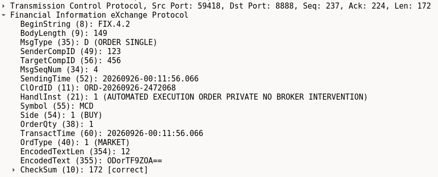
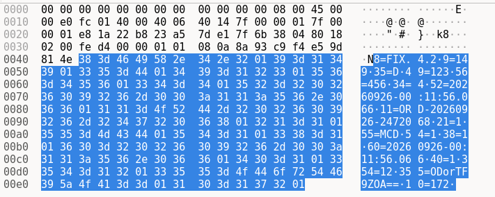
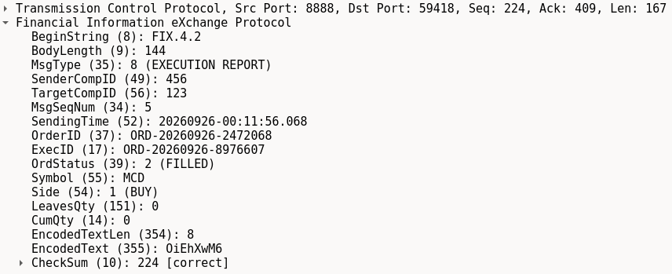
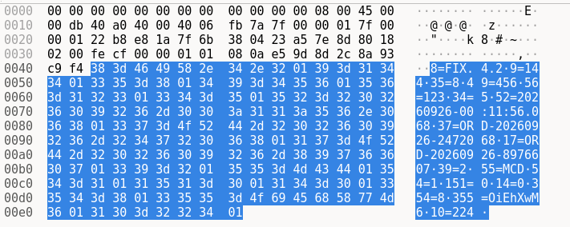
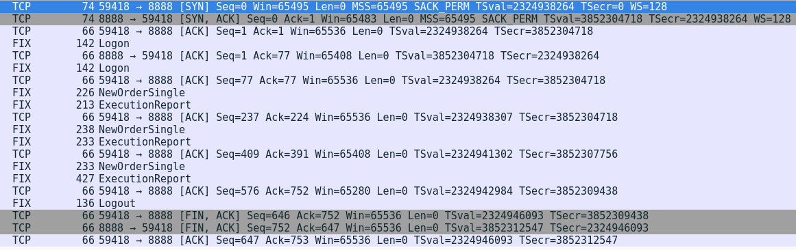

# FIXfu$cated-C2

Basic PoC bind shell that uses Financial Information eXchange (FIX) protocol for disguising C2 traffic as stock trades.

Full writeup can be found [here](https://gr3ko.dev/muses/fixfuscated-c2/readme.html).

## Features

- FIX protocol-spec Logon, Logout, NewOrderSingle (market stock buy), and ExecutionReport messages
- C2 commands are embedded in stock trade requests sent to the executor (the C2 implant bind shell)
- C2 output is embedded in execution reports sent back to the trade client (the C2 "server")
- The executor listens for a specific "knock" trade order to begin receiving commands
- C2 payloads are XOR encrypted using the order/execution IDs sent with each command

Todo: some features like heartbeats and other details aren't implemented


In wireshark, trade orders with embedded commands from the trade client look like this:





The command output sent back as execution reports  by the executor (the C2 implant) look like this:






A basic connection, brief command exchange, and logout looks like the following in a wireshark capture:




## Build/Usage

Build executor:
```
go build executor.go
```

Build tradeclient:
```
go build tradeclient.go
```

Run executor bind shell (C2 implant):
```
./executor <port>
```

Run tradeclient (C2 "server", shell you send commands from):
```
./tradeclient <executor IP> <executor port>
```
